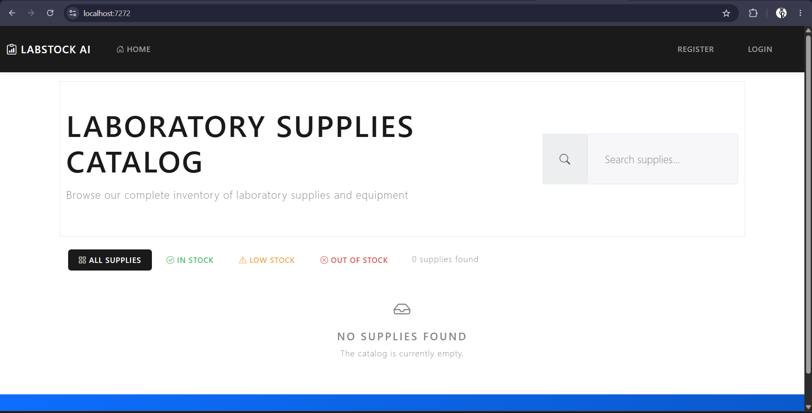
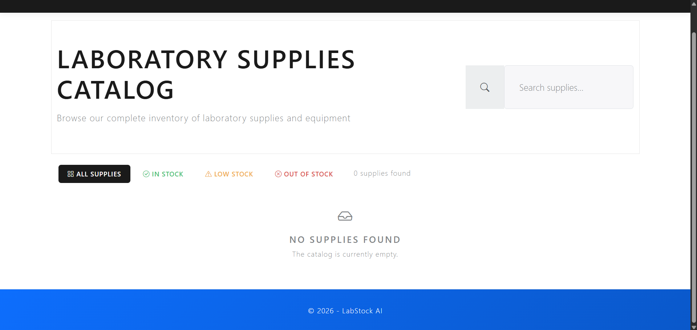
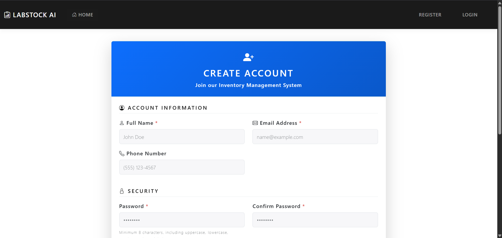
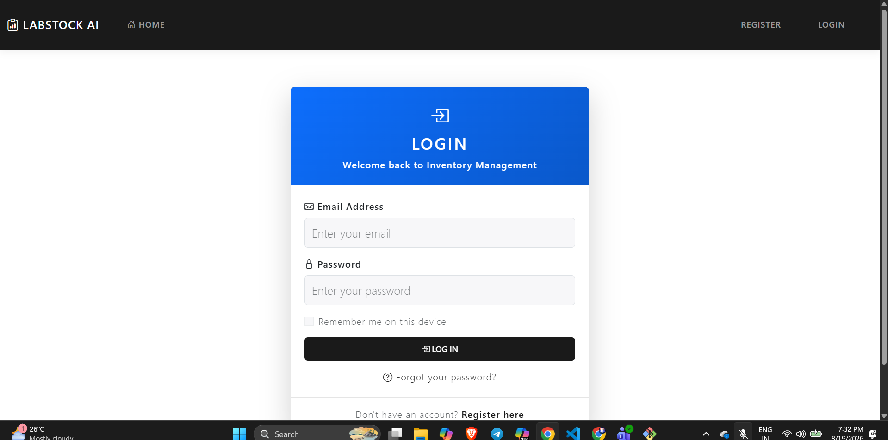

# LabStock AI

LabStock AI is a **web application for laboratory inventory management**, designed to manage laboratory supplies, suppliers, purchase orders, and stock adjustments through a centralized system.

## Current Progress

The **functional user interface (UI) of the web application** has been set up and is currently working. The interface includes navigation, dashboard, inventory management, lab supplies, suppliers, purchase orders, stock adjustment, login, and registration pages.

## Current UI

### Home Page

### Dashboard

### Inventory Management

### Login Page

> **Note:** The screenshots above show the current working interface. More screenshots and features will be added as development progresses.

## Project Documentation

The repository contains documentation for:

- **Requirement Analysis:** Covers the business problem, stakeholders, users, actors, functional and non functional requirements, user stories, and acceptance criteria.
- **Database Design:** Defines the database structure and relationships required for the system.
- **Agile Sprint Planning:** Describes the planned development activities and sprint organization.

## Technology Stack

- **Backend:** ASP.NET Core and C#
- **Frontend:** HTML, CSS, Bootstrap, and JavaScript
- **Database:** SQL Server
- **Authentication:** ASP.NET Core Identity
- **Version Control:** Git and GitHub

## Project Status

**Current Status:** Functional web application UI and initial project documentation completed.

Further functionality, testing, UI improvements, and project specific features will be added as development continues.
